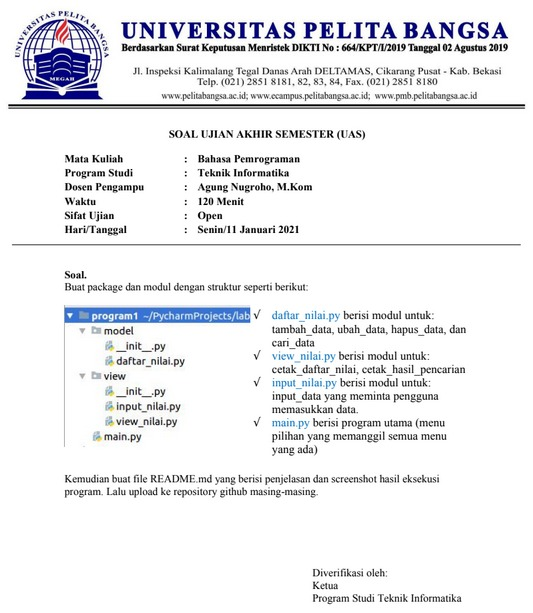

# UAS2020

# UJIAN-AKHIR-SEMESTER-UAS-2020-2021-
# NAMA : Oen Hutajulu <br>
# Nim : 312010155
# Kelas : TI.20.A1

Soal


* Pada tugas UAS, saya diminta untuk membuat sebuah program menambahkan data ke sebuah list dengan sistem library root yang nantinya akan seperti ini.
### Berikut inputannya

```python
from data import data

print("PROGRAM MENAMPILKAN DAFTR NILAI MAHASISWA")
while True:
    print("")
    c =input("(L)lihat, (T)ambah, (U)bah, (H)apus, (K)eluar : ")
    if c.lower() == 't':
        print("=======Tambah Data=======")
        nama = input("Nama                :  ")
        nim = input("Nim                 :  ")
        tugas = int(input("Masukan Nilai Tugas :  "))
        uts = int(input("Masukan Nilai UTS   :  "))
        uas = int(input("Masukan Nilai UAS   :  "))
        akhir = (0.30 * tugas) + (0.35 * uts) + (0.35 * uas)
        data[nama] = nim, tugas, uts, uas, akhir
    elif c.lower() == 'u':
        print('=======Ubah Data Mahasiswa=======')
        nama = input('Nama                :  ')
        if nama in data.keys():
            nim = input('Nim                 :  ')
            tugas = int(input("Masukan Nilai Tugas :  "))
            uts = int(input("Masukan Nilai UTS   :  "))
            uas = int(input("Masukan Nilai UAS   :  "))
            akhir = (0.30 * tugas) + (0.35 * uts) + (0.35 * uas)
            data[nama] = nim, tugas, uts, uas, akhir
        else:
            print("Data Nilai Tidak Ada".format(nama))

    elif c.lower() == 'l':
        print("=======Daftar Nilai Mahasiswa=======")
        print("================================================================================================")
        print(" |NO   |     NAMA      |    NIM    |     TUGAS    |     UTS     |       UAS    |    AKHIR     | ")
        print("================================================================================================")
        i = 0
        for x in data.items():
            i += 1
            print(
                " | {6:2}  |  {0:12s} | {1:9s} | {2:11}  | {3:11} | {4:11}  |  {5:11} |".format(x[0], x[1][0], x[1][1],
                                                                                                x[1][2], x[1][3],
                                                                                                x[1][4], i))
            print("============================================================================================")

    elif c.lower() == 'h':
        print("=======Hapus Data Mahasiswa=======")
        nama = input("Nama :  ")
        if nama in data.keys():
            del data[nama]
        else:
            print("Data Nilai Tidak Ada".format(nama))

    elif c.lower() == 'k':
        print("Keluar")
        break
```
## Dan Setelah Kita Menemukan Hasil Nya Mari Saya Jelaskan Perinciannya
```python
* Langkah Pertama Yang Harus Lakukan Adalah kita membuat variable list kosong.
```python
from data import data
```
* Setelah itu kita membuat kondisi perulangan dan statement yang akan dijalankan ketika perulangan terjadi. Dan Ini inputannya
```python
print("PROGRAM MENAMPILKAN DAFATR NILAI MAHASISWA")
while True:
    print("")
    c =input("(L)lihat, (T)ambah, (U)bah, (H)apus, (K)eluar : ")
```
* Berikutnya tambahkan inputan Fungsi Tambahkan
```python
if c.lower() == 't':
print("=======Tambah Data=======")
        nama = input("Nama                :  ")
        nim = input("Nim                 :  ")
        tugas = int(input("Masukan Nilai Tugas :  "))
        uts = int(input("Masukan Nilai UTS   :  "))
        uas = int(input("Masukan Nilai UAS   :  "))
        akhir = (0.30 * tugas) + (0.35 * uts) + (0.35 * uas)
        data[nama] = nim, tugas, uts, uas, akhir
```
* Tambahkan inputan Fungsi Ubah
```python
elif c.lower() == 'u':
print('=======Ubah Data Mahasiswa=======')
        nama = input('Nama                :  ')
        if nama in data.keys():
            nim = input('Nim                 :  ')
            tugas = int(input("Masukan Nilai Tugas :  "))
            uts = int(input("Masukan Nilai UTS   :  "))
            uas = int(input("Masukan Nilai UAS   :  "))
            akhir = (0.30 * tugas) + (0.35 * uts) + (0.35 * uas)
            data[nama] = nim, tugas, uts, uas, akhir
        else:
            print("Data Nilai Tidak Ada".format(nama))
```
* Tambahkan inputan Fungsi Tampilkan
```python
elif c.lower() == 'l':
 print("=======Daftar Nilai Mahasiswa=======")
        print("================================================================================================")
        print(" |NO   |     NAMA      |    NIM    |     TUGAS    |     UTS     |       UAS    |    AKHIR     | ")
        print("================================================================================================")
        i = 0
        for x in data.items():
            i += 1
            print(
                " | {6:2}  |  {0:12s} | {1:9s} | {2:11}  | {3:11} | {4:11}  |  {5:11} |".format(x[0], x[1][0], x[1][1],
                                                                                                x[1][2], x[1][3],
                                                                                                x[1][4], i))
            print("============================================================================================")
```
* Tambahkan inputan Fungsi Hapus
```python
elif c.lower() == 'h':
print("=======Hapus Data Mahasiswa=======")
        nama = input("Nama :  ")
        if nama in data.keys():
            del data[nama]
        else:
            print("Data Nilai Tidak Ada".format(nama))
```
* Tambahkan inputan Fungsi Keluar
```python
elif c.lower() == 'k':
print("Keluar")
        break
```
* hasil dari program yang telah dibuat


